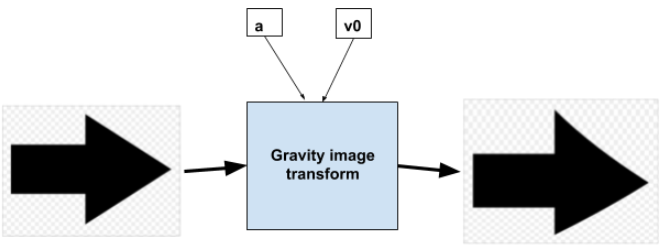

# Gravity image transformation
## Short description:
We can imagine a screen where lines are drawn on the top of the screen, and than while falling they form an image. Such image will be perfectly sharp if the velocity of falling is constant.

The problem appears when we consider gravity force and the lines that are forming the image are accelerating.

This project provides one of possible solutions to optimize sharpness of falling image. The algorithm attempts to transform image in such way to make image sharpest in the middle of the 'gravity screen'.

When we display transformed image on 'gravity display' we can see a significant improvement in sharpness of the image.

## Most important files:
- `src/water_display.py` - this is a simple simulation of described screen written using pygames
- `src/ImageTransform.py` - this file contains the algorithm itself
